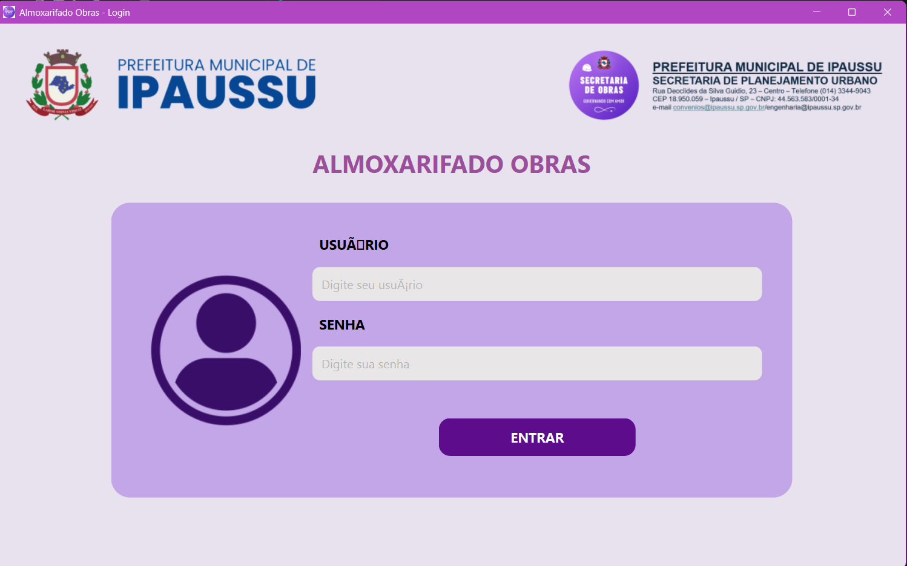
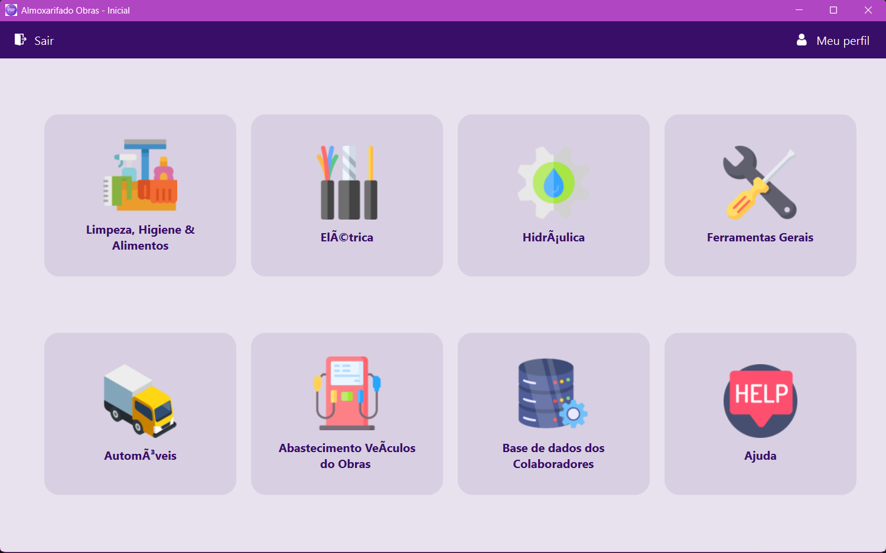
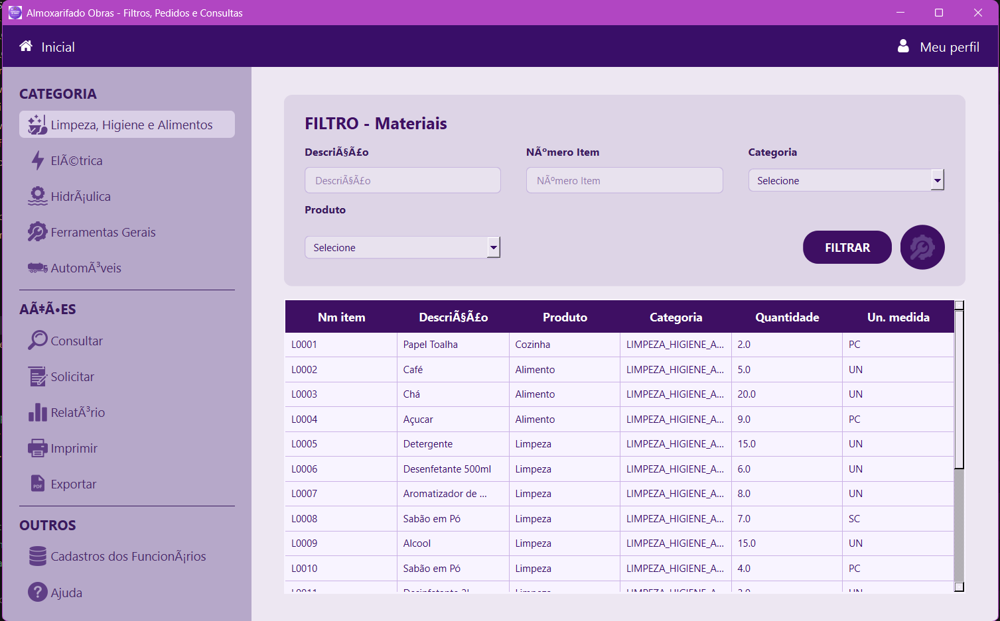
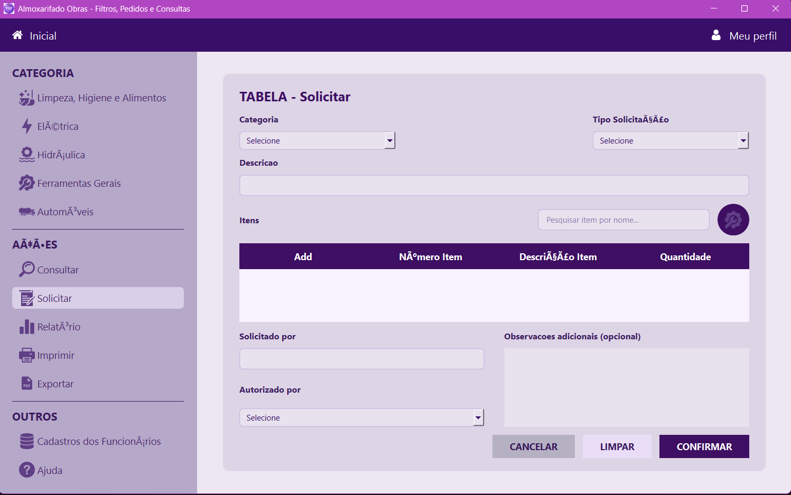
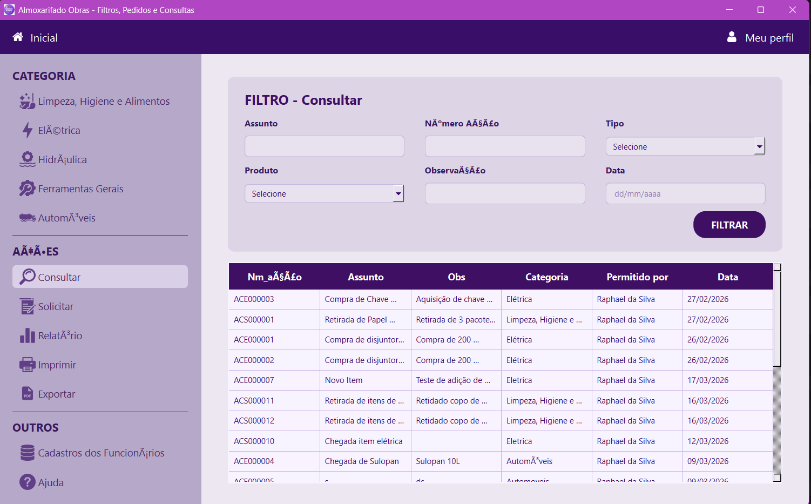
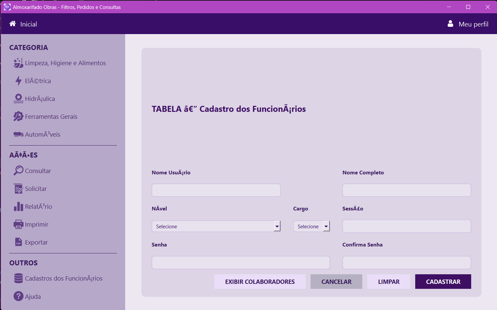
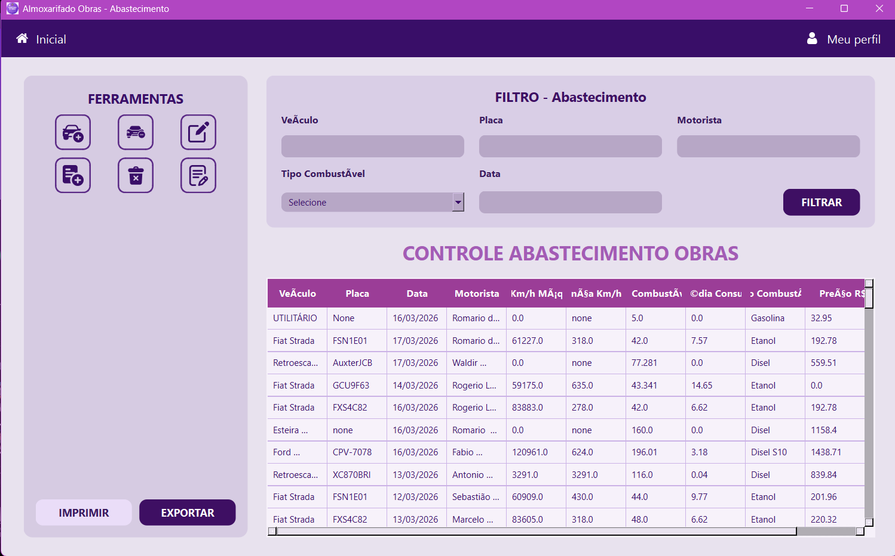
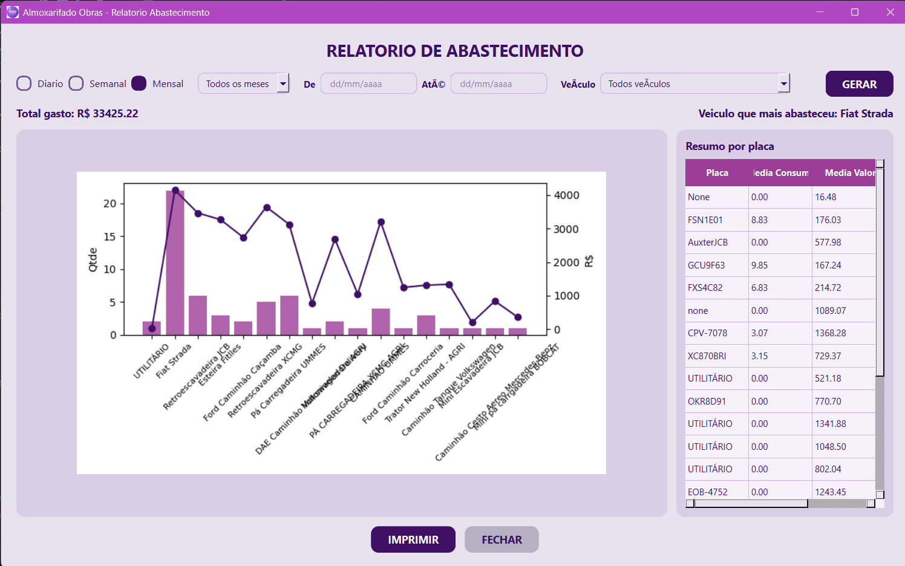
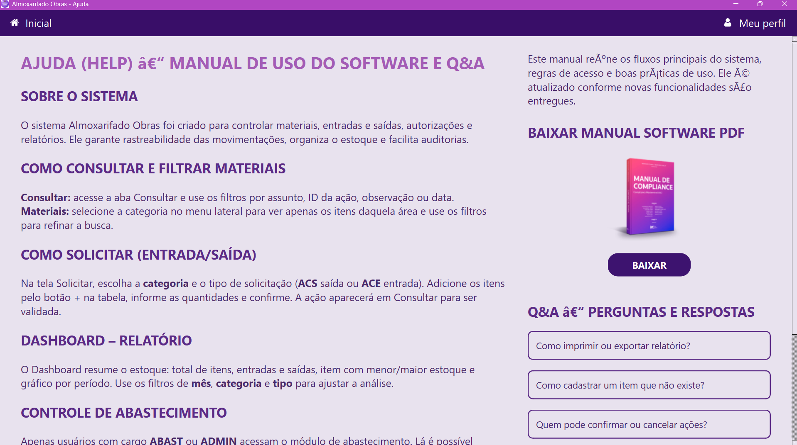

# <p align="center">SISTEMA DE ALMOXARIFADO E CONTROLE DE ABASTECIMENTO</p>

<p align="center">
Sistema desktop para gestão de almoxarifado, movimentação de materiais, controle de solicitações e controle de abastecimento.
</p>

---

## Autor

- Autor: Raphael da Silva
- Projeto: Sistema de Almoxarifado / Controle Operacional
- Tipo de aplicação: Desktop
- Stack principal: Python, PySide6, SQLite, FastAPI

---

## Sumário

- [1. Apresentação](#1-apresentação)
- [2. Objetivo do sistema](#2-objetivo-do-sistema)
- [3. Principais módulos](#3-principais-módulos)
- [4. Funcionalidades implementadas](#4-funcionalidades-implementadas)
- [5. Perfis de acesso e regras de permissão](#5-perfis-de-acesso-e-regras-de-permissão)
- [6. Arquitetura da aplicação](#6-arquitetura-da-aplicação)
- [7. Estrutura de pastas](#7-estrutura-de-pastas)
- [8. Banco de dados](#8-banco-de-dados)
- [9. Fluxos operacionais](#9-fluxos-operacionais)
- [10. Capturas de tela](#10-capturas-de-tela)
- [11. Requisitos para execução](#11-requisitos-para-execução)
- [12. Como executar o sistema](#12-como-executar-o-sistema)
- [13. Execução com API para múltiplas máquinas](#13-execução-com-api-para-múltiplas-máquinas)
- [14. Geração de executável e instalador](#14-geração-de-executável-e-instalador)
- [15. Estado atual do projeto](#15-estado-atual-do-projeto)

---

## 1. Apresentação

Este projeto foi desenvolvido para atender rotinas operacionais de almoxarifado e abastecimento com foco em controle interno, rastreabilidade e organização dos dados.

O sistema possui interface desktop, controle por usuário, separação por módulos e persistência local em SQLite, com evolução para uso compartilhado em rede via API.

O objetivo prático do software é centralizar atividades que normalmente ficam dispersas em anotações manuais, planilhas e processos sem padrão, reduzindo erro operacional e melhorando o acompanhamento das movimentações.

---

## 2. Objetivo do sistema

O sistema foi projetado para:

- controlar materiais por categoria;
- registrar solicitações de entrada e saída;
- confirmar ou cancelar movimentações com impacto real no estoque;
- cadastrar e gerenciar colaboradores;
- controlar abastecimentos de veículos e máquinas;
- emitir relatórios operacionais;
- preparar a aplicação para uso em mais de uma máquina.

---

## 3. Principais módulos

### 3.1 Home

Tela inicial com navegação para os módulos do sistema, respeitando o perfil do usuário autenticado.

### 3.2 Materiais

Módulo de consulta e filtro de materiais cadastrados por categoria, descrição, número do item, produto e grupo.

### 3.3 Solicitar / Consultar

Módulo responsável por gerar e acompanhar movimentações do estoque.

Tipos principais:

- `ACS`: Ação de Consulta de Saída
- `ACE`: Ação de Consulta de Entrada

### 3.4 Cadastro de materiais via ACE

Fluxo especial para registrar novos itens ainda não existentes na base, gerando a movimentação como `ACE` e concluindo a entrada no estoque somente quando a ação for confirmada.

### 3.5 Cadastro de colaboradores

Módulo para criação e gerenciamento de usuários do sistema, com controle por cargo e nível.

### 3.6 Perfil

Tela do usuário com dados da conta e salvamento de imagem no banco.

### 3.7 Ajuda / Manual

Tela com orientações de uso do sistema, permissões e fluxo operacional.

### 3.8 Controle de abastecimento

Módulo dedicado a:

- cadastro de veículos;
- cadastro de abastecimentos;
- edição e exclusão de registros;
- filtros por veículo, placa, motorista, combustível e data;
- visualização detalhada de cada abastecimento;
- relatórios e exportações.

---

## 4. Funcionalidades implementadas

### 4.1 Autenticação e sessão

- Login com validação de usuário e senha
- Sessão do usuário em memória
- Controle de acesso por cargo e nível
- Restrição de telas e botões conforme permissão

### 4.2 Almoxarifado

- Filtro de materiais por categoria
- Filtro por descrição
- Filtro por número do item
- Filtro por produto
- Filtro por grupo/categoria
- Edição de material
- Exclusão de material
- Geração automática de número de item por categoria

### 4.3 Solicitações de estoque

- Geração de `ACS` e `ACE`
- Seleção de mais de um item na mesma ação
- Abertura da ação pelo módulo Consultar
- Confirmação da ação
- Cancelamento da ação
- Persistência de status para evitar dupla confirmação
- Atualização do estoque conforme o tipo da ação

### 4.4 Cadastro de novos itens pelo módulo Solicitar

- Alternância para modo de cadastro por engrenagem
- Geração automática do número do item
- Inclusão de vários itens da mesma categoria na mesma tela
- Geração automática de `ACE`
- Entrada real no estoque somente após confirmação da ação

### 4.5 Colaboradores

- Cadastro de usuários
- Restrição de criação para cargos autorizados
- Listagem de colaboradores
- Edição e exclusão com restrição administrativa

### 4.6 Perfil

- Salvamento de imagem de perfil no SQLite

### 4.7 Abastecimento

- Cadastro de veículos
- Edição e exclusão de veículos
- Cadastro de abastecimentos
- Edição e exclusão de abastecimentos
- Cálculo de diferença de odômetro
- Cálculo de média de consumo
- Tratamento para odômetro tipo 3 e valores nulos/zero
- Abertura de detalhes do abastecimento
- Relatório gráfico
- Exportação
- Impressão de relatório

### 4.8 API

- Estrutura inicial em FastAPI
- Endpoints para autenticação
- Endpoints para materiais
- Endpoints para ações
- Endpoints para veículos
- Endpoints para abastecimento
- Preparação para ambiente com 2 ou mais máquinas

---

## 5. Perfis de acesso e regras de permissão

As regras abaixo representam o comportamento implementado no projeto até o momento.

### 5.1 Cargos

- `ADMIN`
- `COORD`
- `ABAST`
- `COMUM`

### 5.2 Níveis

- `0`
- `1`

### 5.3 Regras atuais

- `ADMIN` e `COORD` podem cadastrar novos usuários
- somente usuários com permissão adequada acessam o módulo de abastecimento
- confirmação e cancelamento de ações ficam restritos conforme nível
- o sistema esconde botões e acessos quando o perfil não tem permissão

---

## 6. Arquitetura da aplicação

O projeto está organizado em camadas simples e objetivas:

- `gui`: monta a interface visual das telas
- `app`: concentra regras de tela, serviços e fluxo operacional
- `database`: armazena os bancos SQLite
- `api`: camada HTTP para uso remoto em rede
- `assets`: imagens, ícones e recursos visuais
- `tools` e `installer`: automação de build e distribuição

Fluxo geral:

`Interface -> janela/controlador -> serviço -> banco SQLite ou API`

---

## 7. Estrutura de pastas

```text
sistema-almoxarifado/
|
+-- assets/
|   +-- ícones, imagens e logos do sistema
|
+-- database/
|   +-- users.db
|   +-- material.db
|   +-- actions.db
|   +-- control.db
|   +-- vehicles.db
|
+-- docs/
|   +-- documentação auxiliar
|
+-- installer/
|   +-- scripts e configurações para instalador
|
+-- src/
|   +-- api/
|   |   +-- app.py
|   |   +-- config.py
|   |   +-- security.py
|   |   +-- schemas.py
|   |   +-- routers/
|   |
|   +-- app/
|       +-- main.py
|       +-- home.py
|       +-- screen_filter.py
|       +-- control_gas.py
|       +-- profile.py
|       +-- help.py
|       +-- material_service.py
|       +-- action_service.py
|       +-- control_gas_service.py
|       +-- vehicle_service.py
|       +-- remote_api.py
|       +-- auth/
|       |   +-- auth_service.py
|       |   +-- session.py
|       |
|       +-- gui/
|           +-- resources.qrc
|           +-- resources_rc.py
|           +-- window/
|               +-- main_window/
|                   +-- interfaces das telas
|
+-- tools/
|   +-- scripts de build, apoio e manutenção
|
+-- README.md
+-- LICENSE
+-- requirements.txt
```

---

## 8. Banco de dados

O projeto utiliza SQLite com separação por contexto funcional.

### 8.1 `users.db`

Responsável por usuários, credenciais, cargo, nível, sessão/tag e imagem de perfil.

### 8.2 `material.db`

Responsável pelo cadastro dos materiais e quantidade em estoque.

Campos principais:

- número do item
- descrição
- produto
- categoria
- quantidade
- unidade de medida

### 8.3 `actions.db`

Responsável pelas movimentações do estoque.

Campos principais:

- `id_action`
- `matter`
- `observation`
- `category`
- `solocitated`
- `authorized`
- `date`
- `id_item`
- `descrption`
- `quantity`
- `status`

### 8.4 `control.db`

Responsável pelo controle de abastecimento.

### 8.5 `vehicles.db`

Responsável pelo cadastro dos veículos utilizados no módulo de abastecimento.

---

## 9. Fluxos operacionais

### 9.1 Fluxo de materiais

1. Usuário acessa a categoria desejada.
2. O sistema carrega a tabela de materiais da categoria.
3. O usuário pode aplicar filtros.
4. O usuário pode editar ou excluir materiais pela ferramenta de configuração.

### 9.2 Fluxo de solicitação

1. Usuário acessa `Solicitar`.
2. Seleciona categoria.
3. Seleciona o tipo da movimentação.
4. Informa descrição, solicitante e autorização.
5. Seleciona um ou mais itens.
6. Informa quantidade de cada item.
7. Gera a ação.
8. A ação aparece em `Consultar`.
9. A confirmação atualiza o estoque.

### 9.3 Fluxo de cadastro de novo item

1. Usuário acessa `Solicitar`.
2. Clica na engrenagem.
3. O layout muda para modo de cadastro.
4. Seleciona a categoria.
5. O sistema gera automaticamente o número de item.
6. Usuário preenche um ou mais itens na tabela.
7. Ao clicar em `Cadastrar`, o sistema gera uma `ACE`.
8. O item entra no estoque somente quando a ação for confirmada.

### 9.4 Fluxo de abastecimento

1. Usuário entra no módulo de abastecimento.
2. Pode filtrar registros existentes.
3. Pode cadastrar, editar ou excluir abastecimentos.
4. Pode cadastrar, editar ou excluir veículos.
5. Pode abrir o detalhe do abastecimento.
6. Pode gerar relatório e exportação.

---

## 10. Capturas de tela

Use esta seção para documentar visualmente o sistema.

### 10.1 Tela de login




### 10.2 Tela inicial





### 10.3 Filtro de materiais



### 10.4 Solicitar materiais



### 10.5 Consulta de ações



### 10.6 Cadastro de colaboradores



### 10.7 Controle de abastecimento



### 10.8 Relatório de abastecimento



### 10.9 Ajuda / Manual



---

## 11. Requisitos para execução

### 11.1 Requisitos de software

- Python 3.11 ou superior
- Pip atualizado
- Windows (ambiente principal do projeto)

### 11.2 Dependências

As bibliotecas necessárias estão listadas em:

```text
requirements.txt
```

---

## 12. Como executar o sistema

### 12.1 Clonar ou copiar o projeto

```powershell
git clone <URL_DO_REPOSITORIO>
cd sistema-almoxarifado
```

### 12.2 Criar ambiente virtual

```powershell
python -m venv .venv
```

### 12.3 Ativar ambiente virtual

```powershell
.\.venv\Scripts\Activate
```

### 12.4 Instalar dependências

```powershell
pip install -r requirements.txt
```

### 12.5 Executar a aplicação desktop

```powershell
python src/app/main.py
```

---

## 13. Execução com API para múltiplas máquinas

Quando o sistema for usado em 2 ou mais computadores, a estratégia recomendada é executar a API em uma máquina servidora e apontar os clientes para esse endereço.

### 13.1 Subir a API

```powershell
python -m src.api
```

### 13.2 Configurar variáveis de ambiente no cliente

```powershell
$env:ALMOX_API_BASE_URL="http://IP_DO_SERVIDOR:8000"
$env:ALMOX_API_KEY="SUA_CHAVE"
python src/app/main.py
```

### 13.3 Fluxo esperado

- Servidor: mantém banco e API ativos
- Clientes: acessam a API e sincronizam dados entre as máquinas

---

## 14. Geração de executável e instalador

### 14.1 Gerar executáveis

```powershell
pip install pyinstaller
powershell -ExecutionPolicy Bypass -File tools\build_release.ps1
```

### 14.2 Gerar instalador

Se o Inno Setup estiver instalado:

```powershell
& "C:\\Program Files (x86)\\Inno Setup 6\\ISCC.exe" "installer\\AlmoxarifadoSuite.iss"
```

### 14.3 Artefatos esperados

- executável do app desktop
- executável da API
- instalador para distribuição

---

## 15. Estado atual do projeto

O sistema já possui base funcional consistente para demonstração, testes internos, operação assistida e evolução comercial.

Pontos consolidados:

- autenticação
- controle de permissão
- gestão de materiais
- solicitações ACS/ACE
- confirmação de estoque
- cadastro de colaboradores
- perfil
- ajuda
- módulo de abastecimento
- relatórios
- estrutura inicial de API

---

## Observações finais

Este README foi estruturado para servir como base técnica, operacional e comercial do projeto. Ele pode ser expandido com:

- imagens reais do sistema;
- nome oficial do software;
- logo definitiva;
- versão;
- histórico de atualizações;
- orientações de suporte;
- contato comercial.


## Licença

Este projeto utiliza uma licença proprietária e restritiva.

Resumo em português:

- o software e o código-fonte são de propriedade exclusiva do autor;
- não é permitido copiar, modificar, distribuir, revender ou reutilizar o código sem autorização expressa e por escrito;
- o sistema não é open source;
- qualquer uso fora do escopo autorizado pode gerar responsabilidade civil e, quando aplicável, outras medidas legais;
- a proteção jurídica considera, entre outras normas, a Lei do Software (`Lei nº 9.609/1998`) e a Lei de Direitos Autorais (`Lei nº 9.610/1998`).

Consulte o arquivo `LICENSE` para o texto completo da licença.

---

